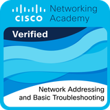
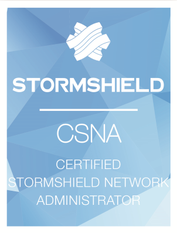

# Mes certifications

  <button class="filter-btn active" onclick="filterCerts('all')">Toutes</button>
  <button class="filter-btn" onclick="filterCerts('cisco')">Cisco</button>
  <button class="filter-btn" onclick="filterCerts('fortinet')">Fortinet</button>
  <button class="filter-btn" onclick="filterCerts('redhat')">Red Hat</button>
  <button class="filter-btn" onclick="filterCerts('stormshield')">Stormshield</button>

---

  <a href="https://www.credly.com/badges/48603306-e3f2-4d36-924b-15d74707945f/public_url" target="_blank">
    

      
    

    

      <h3>Cisco Network Technician Career Path</h3>
      Cisco
    

  </a>

  <a href="https://www.credly.com/badges/9c8f3fd9-7700-4226-aa90-a55cb0760ba4/public_url" target="_blank">
    

      
    

    

      <h3>Cisco Network Support and Security</h3>
      Cisco
    

  </a>

  <a href="https://www.credly.com/badges/b894ab03-a0e8-487d-aac1-7ae886ed79ae/public_url" target="_blank">
    

      
    

    

      <h3>Cisco Network Addressing and Basic Troubleshooting</h3>
      Cisco
    

  </a>

  <a href="https://www.credly.com/badges/be15bd6a-57f4-4457-86ae-f4c1d02beebb/public_url" target="_blank">
    

      
    

    

      <h3>Cisco Networking Devices and Initial Configuration</h3>
      Cisco
    

  </a>

  <a href="https://www.credly.com/badges/c12a2135-bcba-4764-a20b-d8705ec1cf86/public_url" target="_blank">
    

      
    

    

      <h3>Cisco Operating Systems Basics</h3>
      Cisco
    

  </a>

  <a href="https://www.credly.com/badges/57b02e76-a3f5-4032-8856-27da496217d2/public_url" target="_blank">
    

      
    

    

      <h3>Cisco Networking Basics</h3>
      Cisco
    

  </a>

  <a href="https://www.credly.com/badges/2d3a1297-48ed-49f3-b9c2-f95a96a0efde/public_url" target="_blank">
    

      
    

    

      <h3>Cisco Computer Hardware Basics</h3>
      Cisco
    

  </a>

  <a href="https://www.credly.com/badges/a6b7557c-97bc-4dae-bad4-e2a41295acf8/public_url" target="_blank">
    

      
    

    

      <h3>Cisco Introduction to Cybersecurity</h3>
      Cisco
    

  </a>

  <a href="https://www.credly.com/badges/0bad3381-7b25-452c-aaab-df171b443a13/public_url" target="_blank">
    

      
    

    

      <h3>Red Hat Training: Getting Started with Linux Fundamentals</h3>
      Red Hat
    

  </a>

  <a href="https://www.credly.com/badges/e16c673a-5b42-495f-b521-ba105c54e9ad/public_url" target="_blank">
    

      
    

    

      <h3>Fortinet Certified Fundamentals Cybersecurity</h3>
      Fortinet
    

  </a>

  <a href="https://www.credly.com/badges/43b54bea-d42c-4273-9ed1-b59bf1676fef/public_url" target="_blank">
    

      
    

    

      <h3>Fortinet Getting Started in Cybersecurity 2.0</h3>
      Fortinet
    

  </a>

  <a href="https://www.credly.com/badges/9243ae5c-a78e-4625-929c-0f879f322b67/public_url" target="_blank">
    

      
    

    

      <h3>Fortinet Introduction to the Threat Landscape 2.0</h3>
      Fortinet
    

  </a>

  <a href="../assets/stormshield-csna-louis-paret.pdf" target="_blank">
    

      
    

    

      <h3>Stormshield Certified Network Administrator (CSNA)</h3>
      Stormshield
    

  </a>

---